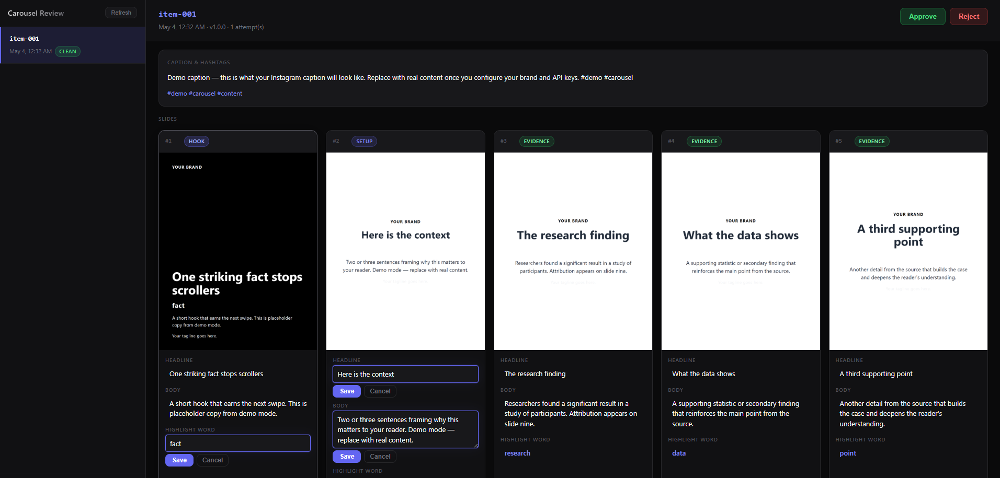

# carousel-pipeline

**v1.0 Stable | Active Architecture | Seeking Community Maintainers**

> The industrial-grade framework for automated, brand-safe social media carousels — LLM-generated copy, AI-generated imagery, Puppeteer composition, and a human review gate. Pluggable for any brand, any source format.

**License:** Apache 2.0 — use it, fork it, build on it. See [CONTRIBUTING.md](./CONTRIBUTING.md) if you want to help maintain it.

---

## What this is

A six-stage pipeline that takes a curated bank of source items (research findings, product specs, statistics, recipes, anything structured) and produces published Instagram carousels:

```
source items → content generation → image generation → composition → human review → publish → metrics
```

Every stage writes to disk and is independently replayable. Every post goes through a human review queue before publishing. A configurable "tripwire" checker scans generated copy against a banned-phrases list, blocking unsafe posts from advancing.

The original use case was translating peer-reviewed health research into legally defensible carousels for a grocery brand. The pipeline has been generalized so the brand voice, banned phrases, color system, source schema, and slide templates are all user-supplied configuration — not hardcoded.

## What this is not

- **Not a hosted service.** You run it. You bring your API keys.
- **Not a managed product.** There is no SLA, no roadmap, and no guarantee of compatibility with future versions of the upstream APIs (Claude, Gemini, Buffer, Meta Graph). When those APIs change, the community fixes it. See [CONTRIBUTING.md](./CONTRIBUTING.md) for open maintainer roles.

If you need a managed, hosted equivalent, this is not it.

---

## Architecture overview

The six stages, each a separate executable that reads from disk and writes to disk:

| Stage | Input | Output | External dependency |
|---|---|---|---|
| 1. Content generation | One source item + brand config | `slides.json`, `caption.txt`, `metadata.json` | Anthropic API |
| 2. Image generation | `slides.json` | `bg-01.png` … `bg-N.png` | Google GenAI (Gemini Image) |
| 3. Composition | slides + backgrounds + slide template | `slide-01.png` … `slide-N.png` | Puppeteer |
| 4. Review | composed slides | approval verdict | Fastify UI on localhost |
| 5. Publish | approved post | scheduled queue entry | Buffer API |
| 6. Metrics | published post | daily insights snapshot | Meta Graph API |

Each stage has an explicit Zod schema for its inputs and outputs. A stage refuses to run on malformed input. This catches errors at the previous step rather than three steps later.

See [docs/SPEC.md](./docs/SPEC.md) for the full design — schemas, retry policy, tripwire semantics, and the brand-safety reasoning behind the pipeline.

---

## Try the demo (no API keys required)

See the pipeline produce real composed slides without any API credentials:

```bash
npm install
cp -r config.example config   # use the bundled example brand config
npm run demo                  # runs all three stages with mock content
npm run review                # open localhost:3000 to see the result
```

This bypasses Claude (Stage 1) and Gemini (Stage 2) entirely — slides are composed from
hardcoded demo copy using your brand template and Puppeteer (Stage 3). No API keys needed.
Output appears in `drafts/item-001/slides/` as real 1080×1350 PNG files you can inspect.

From the review UI at `localhost:3000` you can see the full approve/reject/edit flow.
When you're ready to use real content, follow the [Quick start](#quick-start) below.

---

## Visual proof

> Screenshots and a demo GIF will live here once captured. See [`docs/assets/README.md`](./docs/assets/README.md) for what's planned and how to capture them.

<!-- Once assets are captured, replace this block with:



*Left: `npm run demo` running end-to-end. Right: the review UI at `localhost:3000` showing a composed carousel ready to approve.*
-->

---

## Quick start

```bash
# 1. Install
npm install

# 2. Copy the example configuration and edit for your brand
cp -r config.example config
# Edit config/brand/voice.md, config/brand/tokens.json, config/brand/tripwires.json
# Add your source items to config/items.json

# 3. Set up secrets
cp .env.example .env
# Fill in ANTHROPIC_API_KEY, GOOGLE_API_KEY, BUFFER_ACCESS_TOKEN, META_GRAPH_TOKEN

# 4. Initialize the database
npm run db:init

# 5. Generate a single carousel end-to-end (dry run, no publish)
npm run pipeline -- --item item-001 --dry-run

# 6. Open the review UI
npm run review
# → localhost:3000

# 7. Publish approved carousels to Buffer
#
# BEFORE running this step, you must implement getMediaUrls() in
# scripts/push-approved.ts. Buffer cannot accept file uploads — it fetches
# media from public URLs at publish time. The function currently throws with
# a clear error. Replace it with your own upload logic (S3, GCS, R2, CDN, etc.)
# and return the public URLs for each slide PNG.
#
# This is the only part of the pipeline that requires user-written code.
npm run push-approved
```

### Docker quick start

If you prefer containers, a `docker-compose.yml` is included with Puppeteer's full Chromium dependency stack pre-configured:

```bash
cp .env.example .env          # fill in your API keys
cp -r config.example config   # copy the example brand config
docker compose up review-ui   # starts the review UI on localhost:3000
docker compose run pipeline npm run demo  # run the demo in the container
```

See `Dockerfile` and `docker-compose.yml` in the project root for the full service definitions.

You will not get publishable output on the first run. The brand voice, prompt, and tripwires need iteration.

## Bringing your own brand

Everything brand-specific lives in `config/`. The repository ships a worked example at `config.example/` derived from the original use case (a health-anxious-parents grocery brand) so you can see the shape, not because you should copy it.

```
config/
├── brand/
│   ├── voice.md            # narrative voice rules, tone principles, do/don't framings
│   ├── tokens.json         # colors, font stacks, brand color usage ratios
│   ├── copy.json           # tagline, hero line, fixed lines used across slides
│   └── tripwires.json      # banned phrases (regex + literal), grouped by category
├── templates/              # carousel format templates referenced by your source items
│   └── default.md          # slide-by-slide structural blueprint
├── prompts/
│   └── content-gen.md      # the content-generation prompt (templated)
└── items.json              # your source bank (replaces facts/upf-facts.json)
```

The `config.example/templates/` directory ships with four templates:

| Template | Use case |
|---|---|
| `default` | General-purpose 10-slide structure (research, findings, explainers) |
| `data-scientist` | Quantitative content — earnings reports, benchmarks, survey data |
| `minimalist` | Dark-mode tech aesthetic — developer tools, infrastructure announcements |
| `b2b-brand` | Enterprise/professional services — consulting insights, industry reports |

Add your own by creating a new `.md` file in `config/templates/` and referencing it from the `template` field of a source item. No code changes needed.

The pipeline has no opinion about your domain. If you write health content, the tripwires file blocks unattributed disease claims. If you write financial content, it blocks "guaranteed return" language. If you write recipes, it might be empty. You decide what's dangerous.

See [docs/CONFIGURATION.md](./docs/CONFIGURATION.md) for the configuration schema, validation rules, and how each file is consumed at runtime.

---

## What's actually implemented vs. designed

All six stages are implemented. There is one deliberate stub: `getMediaUrls()` in `scripts/push-approved.ts`.

**Why it's a stub:** Buffer's API requires public URLs for carousel images — it fetches them from the internet at publish time. The pipeline produces PNGs on your local disk (`drafts/{item_id}/slides/*.png`). Getting those files onto a publicly accessible host is infrastructure-specific: the right answer is S3 for some users, GCS for others, Cloudflare R2 for others. Adding any cloud SDK as a hard dependency would force that choice on everyone. Instead, the function is a clearly labelled stub with an example showing exactly what to return. You write ~10 lines, the rest of the publish flow works.

**Everything else is fully implemented:** content generation (Stage 1), image generation (Stage 2), slide composition (Stage 3), the browser-based review UI (Stage 4), Buffer scheduling (Stage 5, minus the URL stub), and Meta Graph metrics polling (Stage 6).

The repository's CI runs unit and integration tests for what was built. It does not run end-to-end tests against live APIs.

---

## License

This project is licensed under the Apache License 2.0. See [LICENSE](./LICENSE) for the full text and [NOTICE](./NOTICE) for third-party attributions.

By using this software, you accept it AS-IS without warranty of any kind. See LICENSE Section 7 for the full disclaimer.

## Contributing

This project is seeking community maintainers. See [CONTRIBUTING.md](./CONTRIBUTING.md) for:
- Open maintainer roles (API Compatibility, TypeScript/Node.js, Puppeteer/Composition, Template Library, Documentation)
- How to submit bug reports and pull requests
- Code conventions and what the project will not accept

Apache 2.0 — fork freely, contribute back if you find it useful.

## Security

If you find a vulnerability: open a GitHub issue describing it. For vulnerabilities that could affect downstream users (tripwire bypass, injection vector in the Puppeteer layer), a public issue is appropriate so other forks can patch their copies.

Do not commit `.env`, API keys, or any other secrets. The `.gitignore` excludes them; verify before pushing.

## Acknowledgments

This pipeline was originally built for an internal use case where translating peer-reviewed research into Instagram carousels at a brand-safe quality bar required automation. It was open-sourced so others working on the same problem in different domains could benefit from the architecture without rebuilding from scratch.
